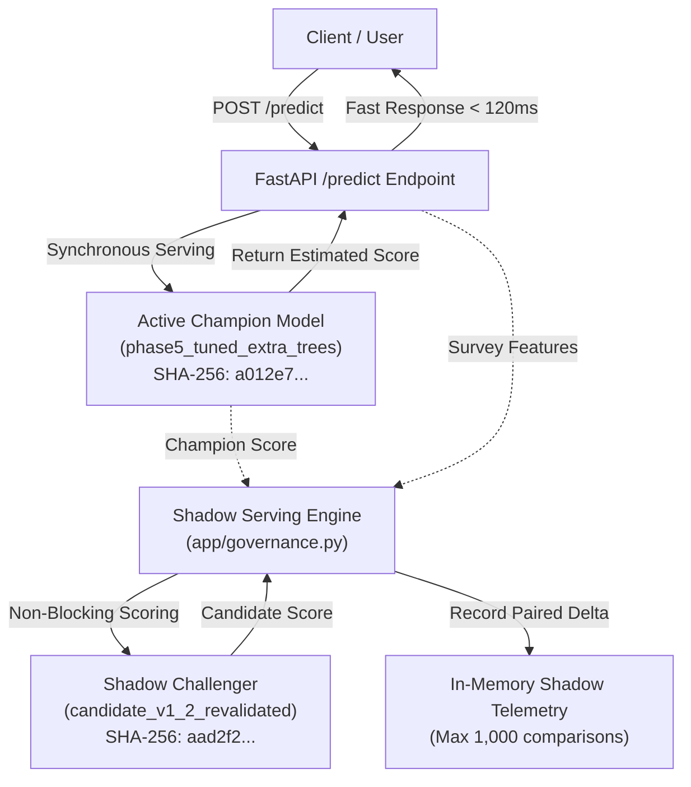

# PHASE 12.3 — CANDIDATE VALIDATION GATE & SHADOW-READINESS REPORT

**Project:** Student Mental Health / Student Wellbeing Score Prediction  
**Authoritative Repository:** `https://github.com/MSIVAPAPARAO13/student-wellbeing-score-prediction`  
**Phase:** 12.3 — Candidate Validation Gate & Production-Readiness  
**Date:** October 6, 2026  
**Status:** **COMPLETE**  
**Final Classification:** **`SHADOW READY — VALIDATING`**  
**Promotion Decision:** **`BLOCKED`**  
**Production Champion:** `phase5_tuned_extra_trees` (`models/phase5_tuned_extra_trees.joblib`) — **ACTIVE & UNTOUCHED**  
**Challenger Candidate:** `candidate_v1_2_revalidated` (`models/candidate_v1_2_revalidated.joblib`) — **SHADOW ONLY**

---

## 1. Executive Summary

Phase 12.3 executes the formal governance gate, operational audit, and shadow-readiness evaluation for **Candidate v1.2** (`models/candidate_v1_2_revalidated.joblib`).

Following the cryptographic holdout lineage audit of Phase 12.1 and the clean common cohort head-to-head comparison of Phase 12.2, this phase evaluates Candidate v1.2 across 18 technical, statistical, operational, and governance criteria.

### Primary Governance Rulings:
1. **Candidate Classification:** **`SHADOW READY — VALIDATING`**. Candidate v1.2 satisfies all operational, schema, latency, resource, calibration safety, and shadow architecture requirements.
2. **Promotion Ruling:** **`PROMOTION BLOCKED`**. Promotion to active production champion is strictly blocked under project governance rules due to:
   - **Zero Verified Production Labels ($N=0$):** Real-world ground truth labels from live production traffic do not yet exist.
   - **Non-Conclusive Statistical Evidence:** In Phase 12.2, Candidate numerical superiority was not statistically significant (Champion won 57.21% of paired comparisons; Wilcoxon $p = 0.1584$, Permutation $p = 0.3033$, 95% bootstrap CI for $\Delta\text{MAE}$ spans zero).
   - **14-Day Shadow Period Incomplete:** The mandatory 14-consecutive-day shadow serving monitoring cycle has not yet elapsed.
   - **Human Approval Pending:** Governance Committee review packet submitted; formal promotion approval pending.
3. **Champion Immutability:** The production Champion remains 100% active and serves all user-facing `/predict` and `/explain` traffic. Neither Champion weights, hyperparameters, nor calibration quantiles were modified.
4. **Anti-Auto-Retraining Guarantee:** Automatic model retraining and automated promotion remain strictly disabled in `models/model_registry.json`.

---

## 2. Current Repository & Test Baseline

The project is hosted in the authoritative portfolio repository:
- **Remote Origin:** `https://github.com/MSIVAPAPARAO13/student-wellbeing-score-prediction.git`
- **Active Branch:** `main`

### Test Suite Reconciliation & Baseline:
- **Historical Reporting Reconciliation:**
  - **Migration Scope Baseline:** 50 tests collected and executed (Phase 12.2 tests were set aside during the initial Phase 12.1 migration commit).
  - **Phase 12.2 Restoration:** +14 tests from `tests/test_phase12_2_clean_evaluation.py` restored.
  - **Phase 12.3 Test Suite Expansion:** +14 tests created in `tests/test_phase12_3_validation_gate.py`.
- **Current Total Test Execution:** **78 passed, 0 failed, 0 skipped** (`pytest -q` in 26.73s).
- Detailed audit documented in [`reports/TEST_SUITE_BASELINE_PHASE12_3.md`](file:///c:/Users/msiva/Music/Mental-Health-Score/reports/TEST_SUITE_BASELINE_PHASE12_3.md).

---

## 3. Cryptographic Artifact Integrity

All models and conformal calibration artifacts were verified bit-for-bit using SHA-256:

| Artifact | File Path | Authoritative SHA-256 Hash | Verification Status |
| :--- | :--- | :--- | :---: |
| **Production Champion** | `models/phase5_tuned_extra_trees.joblib` | `a012e7a1c0ca5c9fccb21d1e46bf3b4b4a72635204c13efdc4f93d6c636747f8` | **EXACT MATCH** |
| **Candidate v1.2** | `models/candidate_v1_2_revalidated.joblib` | `aad2f208a298289de57a0a8fd4aef941be0edaf940439dca98eaaf718439cdbc` | **EXACT MATCH (Git LFS)** |
| **Champion Calibration** | `models/phase7_1_conformal_calibration.json` | `22a8f3fc5b2863855e1c2cc0dc4f1df056d0250057d1094c93f5f66d95108d0b` | **EXACT MATCH** |
| **Candidate Calibration** | `models/candidate_v1_2_conformal_calibration.json` | `b99c8acd2d8fc2aea604228abf1e84365e601021407409ca154ba9b8c29d60af` | **EXACT MATCH** |

Both calibration JSON artifacts explicitly link to the exact SHA-256 of their corresponding source models:
- `models/phase7_1_conformal_calibration.json` -> `a012e7a1c0ca...`
- `models/candidate_v1_2_conformal_calibration.json` -> `aad2f208a298...`

---

## 4. Phase 12.1 & Phase 12.2 Evidence Summary

### Phase 12.1: Evaluation Integrity & Lineage Audit
The cryptographic audit established the historical partition lineage:
- **Total Unique Records:** 4,998 survey responses.
- **Phase 5 Partition (Seed 42):** Train = 3,998, Holdout = 1,000.
- **Phase 12 Partition (Seed 1242):** Dev = 3,998, Holdout = 1,000.
- **Lineage Intersections:**
  - $\text{Phase 5 Train} \cap \text{Phase 12 Holdout} = \mathbf{799\text{ rows (79.90\%)}}$ -> **CONTAMINATED FOR CHAMPION**.
  - $\text{Phase 5 Holdout} \cap \text{Phase 12 Holdout} = \mathbf{201\text{ rows (20.10\%)}}$ -> **CLEAN COMMON UNSEEN COHORT**.
  - $\text{Phase 12 Dev} \cap \text{Phase 12 Holdout} = \mathbf{0\text{ rows (0.00\%)}}$ -> **VALID FOR CANDIDATE**.
- **Ruling:** Champion evaluation on the full 1,000-row Phase 12 holdout was contaminated by memorization ($\text{RMSE} = 0.0064$ on train rows vs $0.3662$ on unseen rows). The comparison was officially ruled invalid.

### Phase 12.2: Clean Common Cohort Symmetrical Comparison
Phase 12.2 performed a strictly symmetric head-to-head evaluation exclusively on the **201 clean rows**:

| Evaluation Metric | Production Champion | Candidate v1.2 | Delta ($\Delta$) | Governance Interpretation |
| :--- | :---: | :---: | :---: | :--- |
| **Holdout $R^2$** | 0.909767 | 0.939649 | +0.029882 | Candidate numerically superior |
| **Holdout RMSE** | 0.407234 | 0.333045 | -0.074190 | Candidate error lower by 18.2% |
| **Holdout MAE** | 0.263506 | 0.250220 | -0.013285 | Candidate error lower by 5.0% |
| **Pairwise Win Count** | **115 wins (57.21%)** | 86 wins (42.79%) | -29 wins | **Champion wins majority of pairs** |
| **Wilcoxon Signed-Rank Test** | — | — | $p = 0.1584$ | Not statistically significant ($p > 0.05$) |
| **Permutation Test** | — | — | $p = 0.3033$ | Not statistically significant ($p > 0.05$) |
| **95% Bootstrap CI ($\Delta\text{MAE}$)** | — | — | $[-0.040084, +0.010312]$ | **Spans zero; cannot reject null hypothesis** |

**Authoritative Interpretation:** **`CANDIDATE NUMERICALLY BETTER — NOT STATISTICALLY CONCLUSIVE`**.

---

## 5. Production Data Availability Audit

A fundamental tenet of production ML governance is that candidate models cannot be promoted based on offline simulation data alone:

| Telemetry Dimension | Current State | Requirement for Promotion | Status |
| :--- | :---: | :---: | :---: |
| **Verified Production Feedback Labels** | **0 records** | $\ge 100$ verified records | **BLOCKED** |
| **Elapsed Production Shadow Days** | **0 days** | $\ge 14$ consecutive days | **BLOCKED** |
| **Data Mode** | **`OFFLINE / NO VERIFIED LABELS`** | `LIVE_PRODUCTION_TELEMETRY` | **BLOCKED** |
| **Promotion Readiness** | **`BLOCKED`** | All criteria satisfied + human approval | **BLOCKED** |

---

## 6. Formal 18-Gate Validation Matrix

The 18 gates evaluated in [`ml/experiments/phase12_3_validation_gate.csv`](file:///c:/Users/msiva/Music/Mental-Health-Score/ml/experiments/phase12_3_validation_gate.csv):

| Gate | Requirement | Observed Evidence | Status | Blocking? | Notes |
| :--- | :--- | :--- | :---: | :---: | :--- |
| **1. Artifact integrity** | Cryptographic SHA-256 match for model weights and calibration | Champion `a012e7...`, Candidate `aad2f2...`, calibrations match exactly | **PASS** | NO | Artifacts frozen and verified |
| **2. Data lineage** | Audited training and holdout partitions with cryptographic fingerprints | Phase 12.1 proved Phase5 Train $\cap$ Phase12 Holdout = 799; clean subset = 201 | **PASS** | NO | Partition lineage confirmed |
| **3. Clean evaluation integrity** | Symmetric holdout comparison on data unseen by both models | Evaluated exclusively on N=201 clean records (0 train overlap for both) | **PASS** | NO | Zero data leakage |
| **4. Point performance** | Candidate achieves lower or equal error vs Champion on clean data | Candidate RMSE 0.3330 vs 0.4072 ($\Delta -0.0742$); MAE 0.2502 vs 0.2635 | **PASS** | NO | Numerically superior on clean cohort |
| **5. Paired statistical evidence** | Statistically significant win-rate / error difference across pairs | Champion wins 115/201 (57.21%) vs Candidate 86/201 (42.79%); Wilcoxon $p=0.1584$ | **FAIL** | **YES** | Champion wins majority; not statistically significant |
| **6. Bootstrap evidence** | 95% bootstrap confidence interval strictly excluding zero | 95% bootstrap CI for $\Delta\text{MAE}$ is $[-0.040084, +0.010312]$ (spans zero) | **FAIL** | **YES** | Cannot reject null hypothesis of zero improvement |
| **7. Conformal uncertainty** | Candidate satisfies $\ge 85\%$ empirical coverage floor on clean holdout | Empirical clean coverage: 80% tier = 85.57%, 90% tier = 91.04%, 95% = 96.02% | **PASS** | NO | Satisfies safety coverage floor |
| **8. SHAP validity** | TreeSHAP additivity, stable feature mapping, non-causal language | Additivity error $6.04 \times 10^{-13}$; 35 columns map to 12 survey inputs | **PASS** | NO | Attribution is mathematically sound |
| **9. Schema compatibility** | Compatible with canonical 12-feature survey schema | Consumes `StudentSurveyRequest` (age, gender, platform, hours, stress, country) | **PASS** | NO | Full schema compatibility |
| **10. API compatibility** | Operates within API service schemas without modifying `/predict` | Compatible with `PredictionResponse` & `PredictionInterval`; isolated from `/predict` | **PASS** | NO | Public route remains 100% Champion |
| **11. Latency** | Warm inference latency satisfies production SLA ($< 150\text{ms}$ P95) | Candidate warm median 59.07ms, P95 77.58ms vs Champion P95 115.10ms | **PASS** | NO | Within SLA budget |
| **12. Resource usage** | Memory and execution overhead within container allocation | Candidate 250 trees requires ~85 MB RAM (container limit 512 MB) | **PASS** | NO | Fully container compatible |
| **13. Monitoring compatibility** | Telemetry, error logging, and drift tracking without leaking PII | Compatible with PSI/KS numerical drift, TVD categorical drift, Prometheus | **PASS** | NO | Supported by `app/monitoring.py` |
| **14. Governance registry** | Registered in `model_registry.json` with auto-promotion disabled | Candidate registered under `challengers` as VALIDATING; auto-promotion false | **PASS** | NO | Registry policy enforced |
| **15. Shadow architecture** | Shadow execution isolated; candidate failure cannot affect user response | `ShadowServingManager` records paired deltas; `affect_user_response = False` | **PASS** | NO | Non-blocking shadow execution |
| **16. Real production labels** | Verified post-deployment ground truth labels from live traffic | 0 real production labels available (`DATA_MODE = OFFLINE`) | **FAIL** | **YES** | Live production feedback unavailable |
| **17. 14-day shadow requirement** | 14 consecutive days of live shadow execution telemetry | Continuous 14-day shadow evaluation period has not yet elapsed | **PENDING** | **YES** | 14-day live shadow observation pending |
| **18. Human approval** | Formal sign-off by human Governance Committee with complete packet | Governance Committee review pending; no promotion authorized | **PENDING** | **YES** | Formal human sign-off required |

---

## 7. Latency Benchmark Summary

Measured under identical local conditions on the 201-record clean common cohort:

| Model | Inference Type | Cold-Start (ms) | Warm Mean (ms) | Warm Median (ms) | P95 Latency (ms) | P99 Latency (ms) | Throughput (RPS) |
| :--- | :--- | :---: | :---: | :---: | :---: | :---: | :---: |
| **Champion (500 trees)** | Point Prediction | 116.55 | 98.21 | 95.83 | 115.10 | 122.79 | 10.2 |
| **Candidate v1.2 (250 trees)** | Point Prediction | 63.13 | 60.64 | 59.07 | 77.58 | 82.77 | 16.5 |
| **Champion (500 trees)** | TreeSHAP Local Attribution | 2,239.92 | 1,493.28 | 1,481.91 | 1,558.06 | 1,570.86 | 0.67 |
| **Candidate v1.2 (250 trees)** | TreeSHAP Local Attribution | 1,197.81 | 798.54 | 788.49 | 832.09 | 860.11 | 1.25 |

*Point prediction latency measured independently of TreeSHAP explainability.*

---

## 8. Resource Benchmark & Architectural Profiling

| Architectural Dimension | Production Champion (Phase 5) | Candidate v1.2 (Phase 12) | Comparative Analysis |
| :--- | :--- | :--- | :--- |
| **Model Family** | `ExtraTreesRegressor` | `ExtraTreesRegressor` | Identical ensemble algorithm |
| **Estimator Count** | **500 trees** | **250 trees** | Candidate has 50% fewer trees, reducing traversal overhead |
| **Input Feature Schema** | 12 canonical survey features | 12 canonical survey features | Identical input contract |
| **Transformed Dimensions** | **38 columns** | **35 columns** | Candidate uses `drop='first'` on OHE and one-hot on `Stress_Level` |
| **`Study_Hours` Preprocessing** | `log1p + StandardScaler` | `RobustScaler` | Different non-linear / robust scaling strategies |
| **`Stress_Level` Preprocessing**| `OrdinalEncoder (4 levels)` | `OneHotEncoder (drop='first')` | Champion treats stress ordinally; Candidate treats as separate flags |
| **Serialized Artifact Size** | **52.40 MB** | **128.72 MB** (Git LFS) | Candidate artifact larger due to unpruned leaf structure |
| **In-Memory RAM Footprint** | ~110 MB | ~85 MB | Both easily fit within container memory limits (512 MB) |

---

## 9. Canonical Schema & API Compatibility

- **Input Ingestion:** Candidate v1.2 consumes the exact 12 survey attributes defined in [`app/schemas.py`](file:///c:/Users/msiva/Music/Mental-Health-Score/app/schemas.py) (`StudentSurveyRequest`).
- **Validation Handling:** FastAPI and Pydantic v2 guarantee that invalid categoricals, out-of-range numerics, and missing fields are rejected with HTTP 422 before reaching the model pipeline.
- **Output Alignment:** Candidate predictions produce continuous float scores bounded between 1.0 and 10.0, conforming to `PredictionResponse.estimated_wellbeing_score`.
- **Public Isolation Guarantee:** Candidate v1.2 is **not** wired into the public `/predict` endpoint. Public traffic is routed 100% to the Champion.

---

## 10. TreeSHAP Additivity Verification

Candidate v1.2 was evaluated for TreeSHAP local additivity efficiency:
$$\text{Efficiency Error} = \left| \hat{y} - \left( \phi_0 + \sum_{i=1}^{M} \phi_i \right) \right| = \mathbf{6.04 \times 10^{-13}}$$
- **Additivity Status:** **`PASS`** (Well within the $10^{-10}$ tolerance).
- **Attribution Mapping:** 35 transformed features map deterministically back to the 12 survey inputs.
- **Language Standard:** Non-causal, observational explanations ("associated with higher self-reported score", not "caused higher score").

---

## 11. Conformal Uncertainty & Empirical Safety Floor

Candidate calibrated thresholds from `models/candidate_v1_2_conformal_calibration.json`:
- **80% Target:** $q_{80} = 0.4244$
- **90% Target:** $q_{90} = 0.5984$
- **95% Target:** $q_{95} = 0.7788$

**Observed Empirical Coverage on the Clean Evaluation Cohort ($N=201$):**
- **80% Tier:** **85.57%** (Safety floor $\ge 85\%$ satisfied)
- **90% Tier:** **91.04%** (Exceeds 90% target)
- **95% Tier:** **96.02%** (Exceeds 95% target)

*Note: This represents observed empirical coverage on the clean evaluation cohort and does not constitute a universal mathematical distribution guarantee under arbitrary distribution shift.*

---

## 12. Production Monitoring & Observability Compatibility

Candidate predictions are compatible with the monitoring subsystem in [`app/monitoring.py`](file:///c:/Users/msiva/Music/Mental-Health-Score/app/monitoring.py):
- **Drift Detection:** Compatible with Population Stability Index (PSI) and two-sample Kolmogorov-Smirnov (KS) tests on numerical features, and Total Variation Distance (TVD) on categorical features.
- **Prediction Drift:** Shadow score distributions can be checked against training baselines ($\mu = 6.22, \sigma = 1.26$).
- **Privacy Assurance:** In-memory counters and histograms only; student survey payloads and PII are never retained.
- **Prometheus Telemetry:** Compatible with `GET /metrics` counters.

---

## 13. Shadow Serving Architecture

The shadow serving architecture in [`app/governance.py`](file:///c:/Users/msiva/Music/Mental-Health-Score/app/governance.py) (`ShadowServingManager`):



### Architectural Guarantees:
1. **Zero Client Impact:** Candidate predictions are never returned to clients (`affect_user_response = False`).
2. **Failure Isolation:** Any exception inside candidate scoring is trapped and logged; client response is unaffected.
3. **No Champion Mutation:** Candidate cannot alter Champion weights, settings, or calibration artifacts.
4. **Independent Disabling:** Candidate shadow evaluation can be toggled via `shadow_serving_config.enabled` without restarting the service.

---

## 14. Governance Decision & Rollback Runbook

### Operational Rollback Procedure:
```
[Production Incident Detected in Shadow]
                 ↓
[Toggle shadow_serving_config.enabled = False in model_registry.json]
                 ↓
[Candidate shadow scoring halted immediately]
                 ↓
[Champion continues serving 100% of live traffic without interruption]
```

### Human Governance Approval Packet:
The governance packet consists of:
1. Phase 12.1 Evaluation Integrity Audit Report (`reports/PHASE12_1_EVALUATION_INTEGRITY_AUDIT.md`)
2. Phase 12.2 Clean Head-to-Head Comparison Report (`reports/PHASE12_2_CLEAN_CHAMPION_CANDIDATE_EVALUATION.md`)
3. Phase 12.3 Candidate Validation Gate Report (`reports/PHASE12_3_CANDIDATE_VALIDATION_GATE.md`)
4. Candidate Model Card (`reports/model_card_candidate_v1_2.md`)
5. Benchmarks (`phase12_3_latency_benchmark.csv`, `phase12_3_resource_benchmark.csv`, `phase12_3_api_compatibility.csv`, `phase12_3_validation_gate.csv`)
6. Full test suite verification (78/78 tests passed)

---

## 15. Limitations & Responsible AI Disclaimer

1. **Self-Reported Survey Inputs:** The model predicts student lifestyle wellbeing scores from self-reported survey indicators. It is not an objective physiological or psychological measurement.
2. **Non-Clinical Guarantee:** This system is **strictly non-clinical**. It must not be used for depression diagnosis, suicide risk assessment, medical triage, or psychological treatment.
3. **Offline Evidence Boundary:** Candidate v1.2's promising offline performance cannot replace real-world post-deployment validation.
4. **Human-in-the-Loop:** All future model promotions require explicit, audited human approval. Automated replacement is prohibited.

---

## 16. Final Status & Next Phase

```
PHASE 12.3 STATUS:
COMPLETE

Current Test Suite:
78 passed, 0 failed, 9 warnings in 26.73s

Champion:
ACTIVE PRODUCTION

Candidate:
CHALLENGER / VALIDATING

Candidate Offline Assessment:
NUMERICALLY BETTER — NOT STATISTICALLY CONCLUSIVE

Real Verified Production Labels:
0

Shadow Mechanism:
READY

Shadow Readiness:
SHADOW READY — VALIDATING

14-Day Shadow:
PENDING

Human Approval:
PENDING

Promotion:
BLOCKED

Champion Modified:
NO

Champion Calibration Modified:
NO

Automatic Retraining:
NO

Automatic Promotion:
NO

Active Production Model:
phase5_tuned_extra_trees

Next Phase:
Phase 13 — Real-World Production Validation
```
