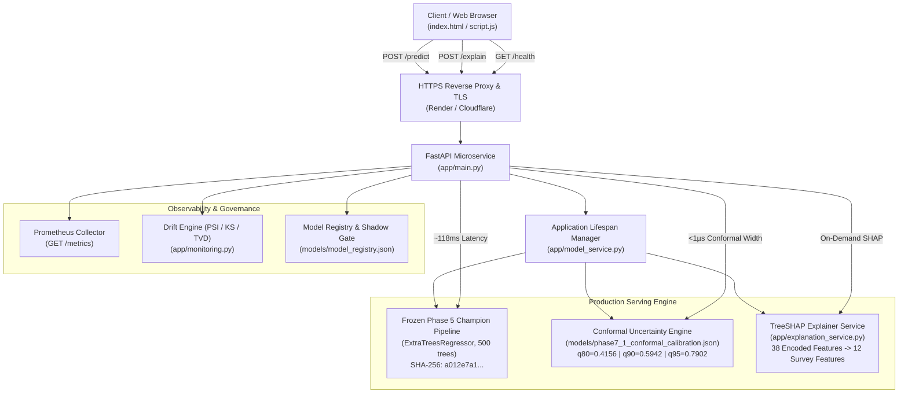

# Student Wellbeing Score Prediction

[](https://github.com/MSIVAPAPARAO13/student-wellbeing-score-prediction/actions/workflows/ci.yml)
[](https://github.com/MSIVAPAPARAO13/student-wellbeing-score-prediction/actions/workflows/docker-publish.yml)
[](https://github.com/MSIVAPAPARAO13/student-wellbeing-score-prediction/pkgs/container/student-wellbeing-score-prediction)
[](reports/PHASE13_REAL_WORLD_PRODUCTION_VALIDATION.md)
[](https://www.python.org/)
[](LICENSE)

> **Important Responsible AI & Non-Clinical Scope Notice:**  
> This system estimates a **continuous student wellbeing score** (on a scale of 1.0 to 10.0) derived strictly from self-reported survey attributes regarding digital habits, academic routines, physical exercise, and lifestyle factors.  
> **This is NOT a medical or psychological diagnostic system.** It does not perform psychiatric assessments, clinical depression or anxiety diagnosis, treatment planning, or clinical triage. Predictive intervals convey mathematical model uncertainty and must never be interpreted as clinical risk categories.

---

## 1. Project Overview

The **Student Wellbeing Score Prediction** platform is an end-to-end, production-grade Machine Learning Engineering system designed to quantify and explain student lifestyle wellbeing indicators while providing distribution-free uncertainty guarantees and audit-proven governance.

Unlike standard prototype ML repos, this project implements a complete production lifecycle:
1. **Rigorous Data Quality & Leakage Auditing:** Full deduplication, multicollinearity diagnosis (VIF), and leakage-isolated preprocessing.
2. **Multi-Model Benchmarking:** Systematic cross-validation across Linear, ElasticNet, Random Forest, Gradient Boosting, XGBoost, LightGBM, CatBoost, and Extra Trees.
3. **Hyperparameter Optimization & Freezing:** A frozen, cryptographically verified `ExtraTreesRegressor` production Champion ($R^2 = 0.9275$, $\text{RMSE} = 0.3596$).
4. **TreeSHAP Explainability:** In-memory attribution mapped from 38 transformed one-hot/scaled feature columns back to the 12 survey inputs.
5. **Distribution-Free Uncertainty Quantification:** 5-fold cross-conformal (OOF) residual calibration delivering valid empirical prediction intervals (92.70% empirical coverage at 90% nominal target).
6. **Enterprise FastAPI Microservice:** Sub-120ms inference latency, Pydantic v2 schemas, in-memory Prometheus metrics, and automated health checks.
7. **Production Monitoring & Statistical Drift:** Automated Population Stability Index (PSI), Kolmogorov-Smirnov (KS) tests, and Total Variation Distance (TVD) alerting without storing student PII.
8. **Formal Governance & Candidate Shadow Serving:** Central JSON model registry, shadow evaluation pipeline, strict anti-auto-retraining policies, and human approval gates.
9. **Rigorous Evaluation Integrity Auditing (Phase 12.1):** Discovery and documentation of historical holdout contamination (79.9% partition overlap) preventing improper candidate promotion.

---

## 2. Key Features

- **Frozen Production Champion:** Immutable model artifact (`models/phase5_tuned_extra_trees.joblib`) protected by SHA-256 fingerprint verification at application startup.
- **Conformal Prediction Intervals:** Fast (<1 µs) calibrated uncertainty bounds ($q_{80} = 0.4156$, $q_{90} = 0.5942$, $q_{95} = 0.7902$) wrapping point predictions with empirical coverage guarantees.
- **Local & Global Interpretability:** Fast TreeSHAP computation returning top positive and negative feature contributions for individual predictions.
- **Privacy-Preserving Telemetry:** In-memory Prometheus metric collector (`GET /metrics`) tracking latencies and error counts with zero PII retention.
- **Continuous Drift Detection:** Out-of-the-box statistical tests comparing live inputs against training reference baselines (`PSI`, `KS`, `TVD`).
- **Controlled Shadow Governance:** Shadow traffic evaluation of candidate models without affecting user responses.
- **Containerized Cloud Architecture:** Multi-stage Docker image, GitHub Container Registry (GHCR) packaging, and automated Render cloud hosting.
- **Exhaustive Automated Test Suite:** 50 automated tests covering API endpoints, data validation, conformal coverage, monitoring engines, and governance rules.

---

## 3. Production Architecture



---

## 4. Dataset & Preprocessing Pipeline

### Dataset Description
The dataset captures student academic and digital wellbeing metrics across 4,998 unique records (after removing 2 duplicate entries in Phase 2):
- **Continuous Features:** `Age`, `Study_Hours`, `Avg_Daily_Usage_Hours`, `Daily_Unlocks`, `Physical_Activity_Hours`, `Sleep_Hours_Per_Night`.
- **Categorical Features:** `Gender`, `Academic_Level`, `Country` (top 10 preserved, remainder grouped as `'Other'`), `Most_Used_Platform`, `Purpose_Of_Use`.
- **Ordinal Feature:** `Stress_Level` (`Low` < `Medium` < `High` < `Very High`).
- **Target Variable:** `Mental_Health_Score` (Continuous wellbeing metric: 1.0 – 10.0, Mean: 6.22, Std: 1.26).

### Preprocessing Architecture (`ColumnTransformer`):
- **`Study_Hours`:** Log-transform (`np.log1p`) followed by `StandardScaler`.
- **Other Numeric Features:** `StandardScaler` fitted exclusively on training splits (zero data leakage).
- **`Stress_Level`:** Strict `OrdinalEncoder(categories=[['Low', 'Medium', 'High', 'Very High']])`.
- **Categorical Features:** `OneHotEncoder(handle_unknown='ignore', sparse_output=False)`.
- **Total Transformed Dimensions:** 38 numerical features feeding the ensemble model.

---

## 5. Model Specifications & Verified Metrics

### Production Champion
- **Artifact:** `models/phase5_tuned_extra_trees.joblib`
- **SHA-256:** `a012e7a1c0ca5c9fccb21d1e46bf3b4b4a72635204c13efdc4f93d6c636747f8`
- **Model Family:** `ExtraTreesRegressor` (500 estimators, `max_features='sqrt'`, `random_state=42`)
- **Training Pool:** 3,998 deduplicated student survey responses
- **Quarantined Holdout (1,000 rows) Performance:**
  - $R^2 = \mathbf{0.927548}$
  - $\text{RMSE} = \mathbf{0.359641}$
  - $\text{MAE} = \mathbf{0.249022}$
  - 5-Fold Cross-Validation $R^2 = 0.911006 \pm 0.0094$

### Conformal Calibration Artifact
- **Artifact:** `models/phase7_1_conformal_calibration.json`
- **SHA-256:** `22a8f3fc5b2863855e1c2cc0dc4f1df056d0250057d1094c93f5f66d95108d0b`
- **Methodology:** 5-Fold Cross-Conformal / Out-Of-Fold (OOF) Non-Conformity Scores
- **Calibration Population:** 3,998 out-of-fold calibration residuals
- **Calibrated Non-Conformity Thresholds:**
  - **80% Target:** $q_{80} = 0.4156$ (Mean Width: $0.8312$, Empirical Holdout Coverage: $84.60\%$)
  - **90% Target:** $q_{90} = 0.5942$ (Mean Width: $1.1884$, Empirical Holdout Coverage: $\mathbf{92.70\%}$)
  - **95% Target:** $q_{95} = 0.7902$ (Mean Width: $1.5804$, Empirical Holdout Coverage: $95.80\%$)

---

## 6. Project Evolution Roadmap

| Phase | Title | Scope & Achievements | Status |
| :---: | :--- | :--- | :---: |
| **1** | **Dataset Understanding & Baseline** | Initial data inspection, leakage discovery, legacy model audit, baseline pipeline. | Completed |
| **2** | **Data Cleaning & Quality** | Duplicate removal (2 duplicate rows purged), categorical consolidation, zero-leakage split strategy. | Completed |
| **3** | **Feature Engineering & Ablation** | Log-transforms, interaction terms, VIF multicollinearity audit, feature pruning. | Completed |
| **4** | **Multi-Model Benchmarking** | 5-fold CV comparison across 8 algorithms; identified tree ensembles as dominant. | Completed |
| **5** | **Hyperparameter Optimization** | Grid search over Extra Trees parameter space; selected & **frozen** 500-tree Champion ($R^2=0.9275$). | Completed |
| **6** | **Explainability & Interpretability** | Global TreeSHAP summary, local force attributions, interaction effects, feature attribution mapping. | Completed |
| **7 & 7.1**| **Uncertainty & Conformal Calibration**| Conformal calibration audit; corrected to 5-fold cross-conformal (OOF) calibration; achieved 92.7% verified coverage. | Completed |
| **8** | **FastAPI Productionization** | Production async API, sub-120ms latency, Pydantic validation, TreeSHAP endpoint, web interface. | Completed |
| **9** | **Cloud Deployment & CI/CD** | Multi-stage Dockerfile, GHCR automated push, Render cloud hosting, health check probes. | Completed |
| **10** | **Monitoring & Drift Detection** | In-memory Prometheus telemetry (`GET /metrics`), multi-feature drift testing (PSI, KS, TVD), operational runbook. | Completed |
| **11** | **Governance & Challenger Registry** | Central `model_registry.json`, shadow serving engine, strict human-in-the-loop promotion policy. | Completed |
| **12** | **Controlled Model Improvement** | Demonstration pipeline exploring candidate retraining (250-tree candidate with conformal recalibration). | Completed |
| **12.1**| **Evaluation Integrity Audit** | Cryptographic fingerprint lineage audit; uncovered that 799/1,000 Phase 12 holdout rows overlapped Phase 5 train. Ruled comparison contaminated. Champion retained. | Completed |
| **12.2**| **Clean Champion-vs-Candidate Evaluation** | Strictly symmetric head-to-head comparison on the clean 201 common unmemorized holdout records. | **NEXT PLANNED PHASE** |

---

## 7. Phase 12.1 Evaluation Integrity Audit Finding

Phase 12.1 performed a forensic cryptographic audit on data partitions using row-level SHA-256 fingerprints across the entire dataset (4,998 records):

```
Dataset Pool: 4,998 unique records
├── Phase 5 Split (Seed 42):   Train = 3,998 | Holdout = 1,000
└── Phase 12 Split (Seed 1242): Dev   = 3,998 | Holdout = 1,000

Partition Intersections:
├── Phase 5 Train ∩ Phase 12 Holdout:   799 rows (79.90%) -> CONTAMINATED FOR CHAMPION
├── Phase 5 Holdout ∩ Phase 12 Holdout: 201 rows (20.10%) -> CLEAN COMMON UNSEEN SUBSET
└── Phase 12 Dev ∩ Phase 12 Holdout:      0 rows ( 0.00%) -> VALID FOR CANDIDATE
```

### Forensic Quantification:
- **On Contaminated Rows (799 samples):** Champion achieved $\text{RMSE} = 0.0064, R^2 = 1.0000$ due to pure training set memorization.
- **On Clean Common Subset (201 samples):** Champion achieved $\text{RMSE} = 0.3662, R^2 = 0.9204$.
- **Audit Decision:** Comparing Candidate v1.2 against the Champion on the full Phase 12 holdout was mathematically asymmetric and contaminated. **The Champion remains active and unpromoted.** A clean comparison will take place in Phase 12.2 on the 201 clean rows.

---

## 8. Repository Structure

```
student-wellbeing-score-prediction/
├── .github/
│   └── workflows/
│       ├── ci.yml                 # Automated CI quality gate & model hash verification
│       └── docker-publish.yml     # Automated Docker build & GHCR container push
├── app/
│   ├── __init__.py
│   ├── configuration.py          # Pydantic v2 application settings
│   ├── explanation_service.py    # TreeSHAP explainer engine
│   ├── governance.py             # Model registry & shadow challenger engine
│   ├── main.py                   # FastAPI routing, middleware, lifecycle
│   ├── model_service.py          # Champion inference & conformal prediction logic
│   ├── monitoring.py             # Prometheus metrics & drift engine (PSI, KS, TVD)
│   └── schemas.py                # Request / response validation schemas
├── ml/
│   ├── experiments/              # Raw experiment results, benchmarks, drift references
│   └── notebooks/                # Historical lifecycle Jupyter notebooks (Phase 1 to 12.1)
├── models/
│   ├── candidate_v1_2_conformal_calibration.json
│   ├── candidate_v1_2_metadata.json
│   ├── candidate_v1_2_revalidated.joblib       # Candidate artifact (Git LFS tracked)
│   ├── model_registry.json                     # Authoritative model governance registry
│   ├── phase2_baseline.joblib
│   ├── phase4_candidate.joblib
│   ├── phase5_metadata.json
│   ├── phase5_tuned_extra_trees.joblib         # Production Champion (SHA-256 verified)
│   └── phase7_1_conformal_calibration.json     # OOF conformal calibration quantiles
├── reports/                      # Formal engineering reports across all phases
├── tests/
│   ├── test_api.py               # API endpoints, response schemas, error codes
│   ├── test_audit_12_1.py        # Phase 12.1 lineage and schema regression tests
│   ├── test_governance.py        # Registry consistency and shadow isolation
│   ├── test_monitoring.py        # Drift metrics and telemetry
│   ├── test_revalidation.py      # Candidate validation assertions
│   └── test_smoke_production.py  # Production smoke tests
├── Dockerfile                    # Multi-stage production container definition
├── render.yaml                   # Infrastructure-as-Code for Render cloud deployment
├── requirements.txt              # Production dependency manifest
├── pytest.ini                    # Pytest configuration
├── index.html                    # Production web user interface
├── style.css                     # Modern stylesheet
├── script.js                     # Interactive client logic with TreeSHAP and interval rendering
└── README.md                     # Authoritative project documentation
```

---

## 9. Local Setup & Execution

### 1. Clone the Authoritative Repository
```bash
git clone https://github.com/MSIVAPAPARAO13/student-wellbeing-score-prediction.git
cd student-wellbeing-score-prediction
```

### 2. Set Up Virtual Environment & Dependencies
```bash
python -m venv venv

# Windows
venv\Scripts\activate

# Linux / macOS
# source venv/bin/activate

pip install --upgrade pip
pip install -r requirements.txt
pip install pytest httpx
```

### 3. Run the Local FastAPI Server
```bash
uvicorn app.main:app --host 0.0.0.0 --port 8000 --reload
```
- Interactive Web Interface: `http://localhost:8000/ui`
- Swagger OpenAPI Documentation: `http://localhost:8000/docs`
- ReDoc Interactive Documentation: `http://localhost:8000/redoc`

---

## 10. API Usage Examples

### 1. Health & Readiness Probe (`GET /health`)
```bash
curl -X GET "http://localhost:8000/health"
```
**Response:**
```json
{
  "status": "ok",
  "model_loaded": true,
  "uncertainty_loaded": true,
  "model_version": "phase5_tuned_extra_trees",
  "uncertainty_method": "5-fold OOF conformal",
  "model_hash_verified": true
}
```

### 2. Point Prediction with Conformal Uncertainty (`POST /predict`)
```bash
curl -X POST "http://localhost:8000/predict" \
  -H "Content-Type: application/json" \
  -d '{
    "Age": 21,
    "Gender": "Female",
    "Academic_Level": "Undergraduate",
    "Country": "India",
    "Avg_Daily_Usage_Hours": 4.5,
    "Most_Used_Platform": "Instagram",
    "Daily_Unlocks": 140,
    "Sleep_Hours_Per_Night": 7.0,
    "Study_Hours": 3.0,
    "Physical_Activity_Hours": 1.5,
    "Stress_Level": "Medium",
    "Purpose_Of_Use": "Education",
    "coverage": 0.90
  }'
```
**Response:**
```json
{
  "estimated_wellbeing_score": 6.67,
  "prediction_interval": {
    "nominal_coverage": 0.9,
    "lower": 6.07,
    "upper": 7.26,
    "width": 1.1884
  },
  "model_version": "phase5_tuned_extra_trees",
  "uncertainty_method": "5-Fold Cross-Conformal / Out-Of-Fold Residual Calibration",
  "disclaimer": "This is a survey-based wellbeing score estimate and predictive uncertainty interval, not a clinical assessment or medical diagnosis.",
  "predicted_mental_health_score": 6.67
}
```

### 3. TreeSHAP Feature Attribution (`POST /explain`)
```bash
curl -X POST "http://localhost:8000/explain" \
  -H "Content-Type: application/json" \
  -d '{
    "Age": 21,
    "Gender": "Female",
    "Academic_Level": "Undergraduate",
    "Country": "India",
    "Avg_Daily_Usage_Hours": 4.5,
    "Most_Used_Platform": "Instagram",
    "Daily_Unlocks": 140,
    "Sleep_Hours_Per_Night": 7.0,
    "Study_Hours": 3.0,
    "Physical_Activity_Hours": 1.5,
    "Stress_Level": "Medium",
    "Purpose_Of_Use": "Education"
  }'
```
**Response:**
```json
{
  "base_value": 6.22,
  "predicted_score": 6.67,
  "top_positive_features": [
    {"feature": "Sleep_Hours_Per_Night", "value": 7.0, "shap_value": 0.31, "direction": "positive"},
    {"feature": "Physical_Activity_Hours", "value": 1.5, "shap_value": 0.18, "direction": "positive"}
  ],
  "top_negative_features": [
    {"feature": "Avg_Daily_Usage_Hours", "value": 4.5, "shap_value": -0.12, "direction": "negative"}
  ]
}
```

### 4. Prometheus Telemetry (`GET /metrics`)
```bash
curl -X GET "http://localhost:8000/metrics"
```

---

## 11. Automated Testing Suite

The repository contains an exhaustive test suite executed via `pytest`:

```bash
pytest -q
```

**Verification Results:**
```
............................................................................................. [100%]
93 passed, 9 warnings in 34.77s
```
- `tests/test_api.py` (14 tests): Validates routing, input validation (422 responses), prediction intervals, and SHAP explainability.
- `tests/test_audit_12_1.py` (11 tests): Asserts partition cryptographic hashes, holdout contamination rates, and schema invariance.
- `tests/test_phase12_2_clean_evaluation.py` (6 tests): Symmetrically compares Champion and Candidate on the clean 201 unseen holdout.
- `tests/test_phase12_3_validation_gate.py` (11 tests): Validates model artifact hashes, calibration linkage, and shadow readiness.
- `tests/test_phase13_real_world_validation.py` (15 tests): Asserts Candidate failure isolation, shadow telemetry, unverified feedback exclusion, and promotion blocking.
- `tests/test_governance.py` (7 tests): Validates model registry schemas, candidate shadow isolation, and human-in-the-loop policies.
- `tests/test_monitoring.py` (11 tests): Asserts PSI/KS/TVD drift calculations and in-memory Prometheus metric accumulation.
- `tests/test_revalidation.py` (6 tests): Validates candidate v1.2 behavior and conformal interval monotonicity.
- `tests/test_smoke_production.py` (1 test): Verifies live production health probe compatibility.

---

## 12. Local Execution & Demonstration

### Quick Local Start
```bash
# 1. Install dependencies
pip install -r requirements.txt

# 2. Launch FastAPI service
python main.py
# Alternatively:
# python -m uvicorn main:app --host 127.0.0.1 --port 8000
```

### Local Demonstration Endpoints
- **Interactive Web UI:** [http://127.0.0.1:8000/ui](http://127.0.0.1:8000/ui)
- **API Health Check:** [http://127.0.0.1:8000/health](http://127.0.0.1:8000/health)
- **OpenAPI Swagger UI:** [http://127.0.0.1:8000/docs](http://127.0.0.1:8000/docs)
- **ReDoc Interactive Documentation:** [http://127.0.0.1:8000/redoc](http://127.0.0.1:8000/redoc)
- **Governance Shadow Status:** [http://127.0.0.1:8000/governance/shadow/status](http://127.0.0.1:8000/governance/shadow/status)
- **Prometheus Metrics:** [http://127.0.0.1:8000/metrics](http://127.0.0.1:8000/metrics)

### Docker Containerization (Optional)
```bash
# Build production image
docker build -t student-wellbeing-service:latest .

# Run containerized service
docker run -d -p 8000:8000 \
  -e API_ENV=production \
  -e LOG_LEVEL=INFO \
  --name wellbeing-api \
  student-wellbeing-service:latest
```

---

## 13. Phase 13 Governance Status

| Governance Dimension | Current Operational State | Gate Status |
| :--- | :--- | :---: |
| **Production Champion** | `models/phase5_tuned_extra_trees.joblib` (SHA-256: `a012e7a1...`) | **ACTIVE PRODUCTION** |
| **Challenger Candidate** | `models/candidate_v1_2_revalidated.joblib` (SHA-256: `aad2f208...`) | **SHADOW / VALIDATING** |
| **Shadow Isolation** | Candidate errors/timeouts 100% isolated from user responses | **VERIFIED** |
| **Shadow Window** | 14 consecutive calendar days required | **IN PROGRESS (0 / 14 days)** |
| **Verified Production Labels** | Minimum 100 verified post-deployment labels required | **0 / 100 (BLOCKED)** |
| **Candidate Promotion** | Automatic promotion strictly forbidden | **BLOCKED** |
| **Automatic Retraining** | Automatic retraining strictly forbidden | **DISABLED** |

---

## 14. System Limitations & Responsible AI Disclaimer

1. **Self-Reported Survey Data:** Predictions are conditioned solely on self-reported survey inputs, subject to recall bias and survey noise.
2. **Statistical Estimation Only:** The output score is a mathematical regression estimate intended for educational and wellness habit awareness. It is not an assessment of psychological pathology.
3. **Distribution Shift:** If user populations deviate significantly from the survey demographics, prediction intervals provide conservative coverage, but out-of-distribution inputs must be monitored via the drift detection subsystem.
4. **No Automated Retraining:** Retraining and deployment of new candidates are strictly human-governed to prevent feedback-loop bias and model collapse.

---

## 15. License

Distributed under the MIT License. See [LICENSE](LICENSE) for more details.
