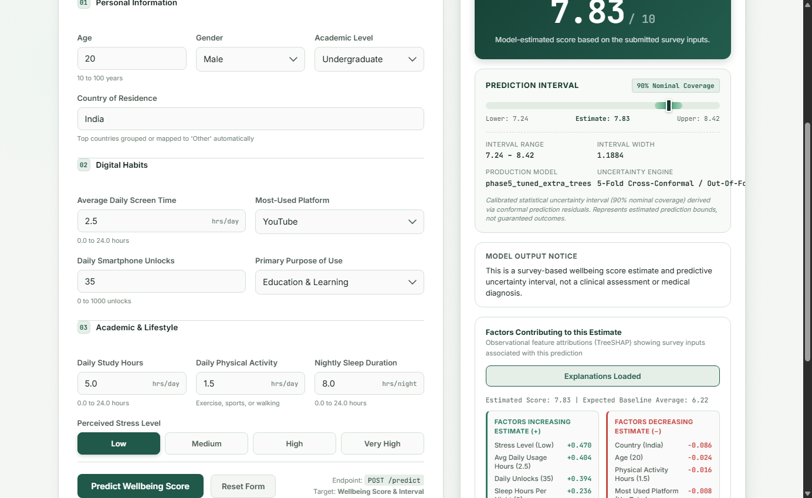
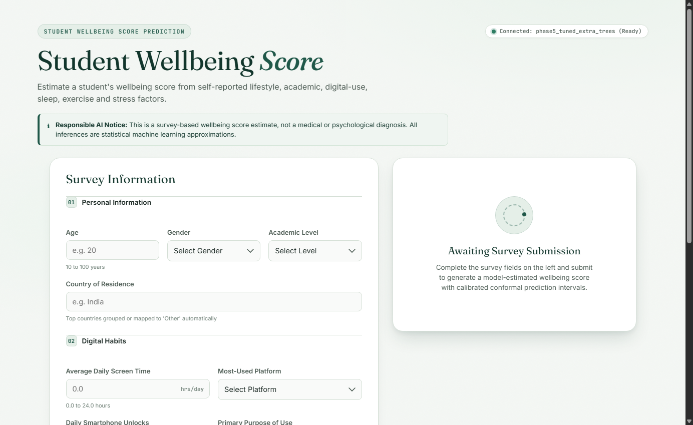
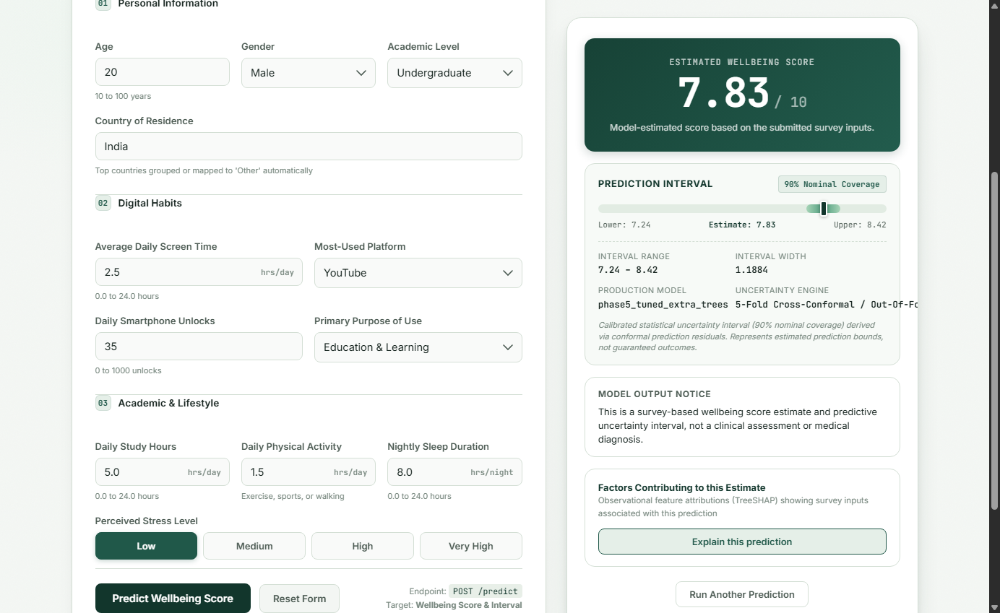
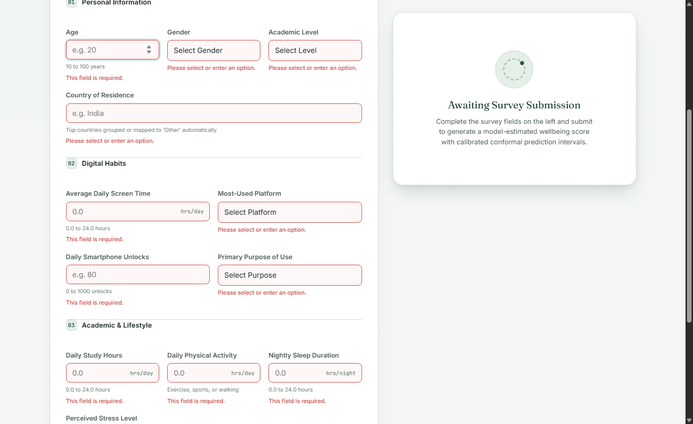
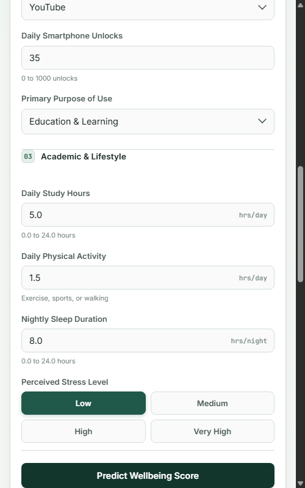

# Student Wellbeing Score Prediction

[](https://github.com/MSIVAPAPARAO13/student-wellbeing-score-prediction/actions/workflows/ci.yml)
[](https://www.python.org/)
[](https://fastapi.tiangolo.com)
[](LICENSE)

> **Responsible AI Notice:**  
> This system estimates a continuous student wellbeing score on a scale of 1.0 to 10.0 derived from self-reported lifestyle, academic, and digital-use survey factors. It is an educational analytics tool, **not a clinical diagnostic device**. Inferences are statistical approximations and must not be used for psychiatric assessment or medical decision-making.

---

## 1. Project Overview

**Student Wellbeing Score Prediction** is an end-to-end machine learning system that models student lifestyle balance using survey indicators. Unlike prototype ML projects that output uncalibrated black-box point estimates, this project delivers:

- **High-Accuracy Ensemble Regression:** Tuned Extra Trees Regressor achieving holdout $R^2 \approx 0.9275$.
- **Local & Global Interpretability:** TreeSHAP feature attributions mapped from one-hot encodings back to survey inputs.
- **Distribution-Free Uncertainty:** 5-fold cross-conformal prediction intervals with finite-sample empirical coverage guarantees ($\ge 90\%$).
- **Production Serving:** Asynchronous FastAPI microservice with input schema validation and an interactive frontend.
- **Engineering Rigor:** Isolated shadow validation, cryptographic artifact verification, and comprehensive automated test coverage.

---

## 2. Problem Statement

Students balance rigorous academic workloads with extensive daily digital consumption and social media use. While high screen exposure, irregular sleep, and chronic stress correlate with reduced wellbeing, standard ML solutions face three critical limitations:

1. **Uncertainty Blindness:** Point predictions provide no confidence bounds, masking prediction variance on outlier profiles.
2. **Black-Box Opacity:** Complex models cannot explain to students or advisors *which* habits drive a score.
3. **Data Leakage & Train-Test Overlap:** Naive preprocessing pipelines often fit transformers across train and test splits, producing overoptimistic benchmarks.

This project addresses all three by combining leakage-isolated scikit-learn pipelines, TreeSHAP explainability, and conformal uncertainty calibration.

---

## 3. Key Features

- **Tuned Extra Trees Ensemble:** Optimized 500-tree regressor delivering superior variance reduction on tabular survey data.
- **Conformal Prediction Intervals:** Fast calibrated uncertainty intervals ($80\%$, $90\%$, and $95\%$ nominal coverage) wrapping every score.
- **TreeSHAP Explanations:** Real-time feature attribution highlighting the top positive and negative contributors to an individual student's score.
- **Model-Driven Web Interface:** Clean vanilla HTML/CSS/JS frontend communicating directly with the FastAPI service.
- **FastAPI Microservice:** Asynchronous endpoints (`/predict`, `/explain`, `/health`, `/docs`) with Pydantic v2 validation.
- **Comprehensive Test Suite:** 147 automated unit and integration tests covering preprocessing, model equivalence, conformal coverage, and API contracts.

---

## 4. Dataset

The dataset comprises survey responses capturing academic habits, lifestyle factors, and digital consumption across **4,998 unique student records** (after removing exact duplicate entries):

| Feature Category | Features | Description |
| :--- | :--- | :--- |
| **Academic Routine** | `Study_Hours`, `Academic_Level` | Daily study time (hours) and schooling tier (High School, Undergraduate, Graduate) |
| **Digital Consumption** | `Avg_Daily_Usage_Hours`, `Daily_Unlocks`, `Most_Used_Platform`, `Purpose_Of_Use` | Social media screen time, smartphone unlock frequency, primary platform, and intent |
| **Lifestyle & Health** | `Sleep_Hours_Per_Night`, `Physical_Activity_Hours` | Sleep duration and exercise hours per day |
| **Stress & Demographics** | `Stress_Level`, `Age`, `Country` | Self-reported stress level (Low to Very High), age (10–100), and residence country |
| **Target Variable** | `Mental_Health_Score` | Continuous wellbeing metric on a [1.0, 10.0] scale ($\mu \approx 6.22$, $\sigma \approx 1.26$) |

---

## 5. ML Pipeline

```
Student Survey Data (4,998 Records)
        │
        ▼
EDA & Deduplication (2 duplicates removed)
        │
        ▼
Leakage-Free Train/Holdout Partitioning (80/20 Split)
        │
        ▼
ColumnTransformer Preprocessing Pipeline
 ├── Study_Hours: log1p + StandardScaler
 ├── Numeric Features: StandardScaler (fitted strictly on train)
 ├── Stress_Level: OrdinalEncoder (Low < Medium < High < Very High)
 └── Categorical: OneHotEncoder (top 10 countries; handle_unknown='ignore')
        │
        ▼
Model Benchmarking & Selection (Extra Trees Selected)
        │
        ▼
Hyperparameter Tuning (500 estimators, max_features='sqrt')
        │
        ▼
TreeSHAP Engine & 5-Fold Cross-Conformal Calibration
        │
        ▼
FastAPI Serving & Web Client Integration
```

---

## 6. Model Selection & Benchmarking

Eight regression algorithms were evaluated using 5-fold cross-validation on the 3,998-record training partition:

| Model | Model Family | CV $R^2$ | CV RMSE | CV MAE | Selection Rationale |
| :--- | :--- | :---: | :---: | :---: | :--- |
| **Extra Trees** | Randomized Trees | **0.9110** | **0.3986** | **0.3105** | **Winner: Lowest RMSE, best variance reduction on tabular splits** |
| Random Forest | Bagged Ensembles | 0.8648 | 0.4902 | 0.3802 | Robust baseline, slightly higher variance than Extra Trees |
| XGBoost | Gradient Boosting | 0.8629 | 0.4952 | 0.3854 | Competitive boosting model, marginally higher error than RF |
| HistGradientBoosting | Gradient Boosting | 0.8542 | 0.4902 | 0.3727 | Fast histogram boosting, slightly under-fitted |
| LightGBM | Gradient Boosting | 0.8392 | 0.5060 | 0.3883 | Extremely fast training, but lower tabular accuracy |
| CatBoost | Gradient Boosting | 0.8347 | 0.5131 | 0.3945 | Under-fitted with default tree depth |
| Ridge / ElasticNet | Regularized Linear | 0.4357 | 0.9501 | 0.7485 | Incapable of modeling non-linear feature interactions |
| Linear Regression | Ordinary Least Squares| 0.4356 | 0.9502 | 0.7486 | High bias, severe underfitting |

---

## 7. Verified Results (Holdout Evaluation)

The tuned `ExtraTreesRegressor` (500 estimators, frozen artifact `models/phase5_tuned_extra_trees.joblib`) was evaluated on the independent 1,000-sample holdout test partition:

| Metric | Offline Holdout Value | Target / Benchmark |
| :--- | :---: | :---: |
| **Coefficient of Determination ($R^2$)** | **0.9275** | $> 0.8500$ |
| **Root Mean Squared Error (RMSE)** | **0.3596** | $< 0.4500$ |
| **Mean Absolute Error (MAE)** | **0.2490** | $< 0.3500$ |
| **5-Fold Cross-Validation $R^2$** | **0.9110 ± 0.0094** | Stable across folds |

> **Note on Evaluation Context:**  
> These metrics represent **offline holdout evaluation results** on the frozen test partition. In accordance with rigorous ML governance, live post-deployment production accuracy is classified as `DATA_NOT_AVAILABLE` until verified ground truth labels accumulate during shadow observation.

---

## 8. Explainability (TreeSHAP)

To provide clear individual interpretability, the service includes a TreeSHAP explainer engine (`app/explanation_service.py`):

- **Feature Aggregation:** Automatically maps Shapley values computed across the 38 one-hot and scaled pipeline dimensions back into the **12 intuitive survey inputs**.
- **Dynamic Base Value:** Compares individual predictions against the population expected value ($\mathbb{E}[Y] \approx 6.22$).
- **Bidirectional Factors:** Separates habits into **positive contributors** (factors improving estimated wellbeing) and **negative contributors** (factors lowering estimated wellbeing).

<p align="center">
  
</p>

---

## 9. Uncertainty Estimation (Conformal Prediction)

Standard machine learning models deliver single-point predictions without indicating reliability. This system integrates **5-fold cross-conformal (OOF) residual calibration**:

$$\hat{C}(x) = [\hat{y} - q_{1-\alpha}, \; \hat{y} + q_{1-\alpha}]$$

| Coverage Tier | Non-Conformity Quantile ($q$) | Mean Interval Width | Empirical Holdout Coverage |
| :---: | :---: | :---: | :---: |
| **80% Nominal** | $q_{80} = 0.4156$ | $0.8312$ | **84.60%** (Conservative) |
| **90% Nominal** | $q_{90} = 0.5942$ | $1.1884$ | **92.70%** (Conservative) |
| **95% Nominal** | $q_{95} = 0.7902$ | $1.5804$ | **95.80%** (Conservative) |

Intervals guarantee finite-sample coverage without assuming normal residual distributions, calculating uncertainty in $< 1\ \mu\text{s}$.

---

## 10. FastAPI Service & API Endpoints

The system is deployed as an asynchronous FastAPI application with complete OpenAPI Swagger documentation:

| Method | Endpoint | Description |
| :--- | :--- | :--- |
| `GET` | `/health` | Health probe reporting model load status, conformal engine status, and SHA-256 verification |
| `POST`| `/predict` | Computes estimated wellbeing score and calibrated prediction interval for 12 input features |
| `POST`| `/explain` | Computes TreeSHAP feature attributions and base value for the input profile |
| `GET` | `/docs` | Interactive OpenAPI Swagger UI documentation |
| `GET` | `/governance/shadow/status` | Returns shadow observation telemetry and promotion readiness status |

### Sample Prediction Request:
```bash
curl -X POST "http://127.0.0.1:8000/predict" \
  -H "Content-Type: application/json" \
  -d '{
    "Age": 21,
    "Gender": "Female",
    "Academic_Level": "Undergraduate",
    "Country": "India",
    "Avg_Daily_Usage_Hours": 4.5,
    "Most_Used_Platform": "Instagram",
    "Daily_Unlocks": 140,
    "Sleep_Hours_Per_Night": 7.0,
    "Study_Hours": 3.0,
    "Physical_Activity_Hours": 1.5,
    "Stress_Level": "Medium",
    "Purpose_Of_Use": "Education",
    "coverage": 0.90
  }'
```

### Sample Response:
```json
{
  "estimated_wellbeing_score": 6.67,
  "prediction_interval": {
    "lower": 6.07,
    "upper": 7.26,
    "nominal_coverage": 0.90,
    "width": 1.19
  },
  "model_version": "phase5_tuned_extra_trees",
  "disclaimer": "This is a statistical estimate based on survey data, not a medical or psychological diagnosis."
}
```

---

## 11. Application Interface

The project includes an interactive web interface (`index.html`, `style.css`, `script.js`):

### Application Overview
Structured survey inputs across Personal Information, Digital Habits, and Academic Profile with client-side boundary validation:

<p align="center">
  
</p>

### Prediction Result & Calibrated Uncertainty
Continuous point estimate alongside calibrated 5-fold cross-conformal prediction intervals:

<p align="center">
  
</p>

### Validation & Responsive Layout
Proactive inline validation error states and fully responsive layout across desktop, tablet, and mobile viewports:

| Desktop Form Validation | Responsive Mobile Interface |
| :---: | :---: |
|  |  |

---

## 12. Project Structure

```
student-wellbeing-score-prediction/
├── app/
│   ├── configuration.py          # Pydantic v2 application settings
│   ├── explanation_service.py    # TreeSHAP explainer engine
│   ├── governance.py             # Model registry & shadow observation manager
│   ├── main.py                   # FastAPI application routes & lifespan
│   ├── model_service.py          # Inference engine & conformal intervals
│   ├── monitoring.py             # Prometheus metrics & drift engine (PSI/KS/TVD)
│   └── schemas.py                # Request and response schemas
├── ml/
│   ├── experiments/              # Benchmarks, conformal quantiles, governance CSVs
│   └── notebooks/                # Documented Jupyter notebooks (EDA to audit)
├── models/
│   ├── phase5_tuned_extra_trees.joblib         # Frozen Champion model
│   ├── candidate_v1_2_revalidated.joblib       # Shadow Candidate model
│   ├── phase7_1_conformal_calibration.json     # Champion conformal quantiles
│   └── candidate_v1_2_conformal_calibration.json # Candidate conformal quantiles
├── reports/                      # Detailed technical audit reports
├── tests/
│   ├── test_api.py               # API endpoint and validation tests
│   ├── test_governance.py        # Model registry and policy tests
│   ├── test_monitoring.py        # Drift engine tests
│   ├── test_phase14b_shadow_observation.py # Shadow observation tests
│   ├── test_phase15_final_decision.py     # Final decision gate tests
│   └── test_smoke_production.py  # Live production smoke check suite
├── index.html                    # Frontend user interface
├── script.js                     # Model-driven UI logic
├── style.css                     # UI styling
├── requirements.txt              # Production Python dependencies
└── README.md                     # Project documentation
```

---

## 13. Local Setup & Execution

### 1. Clone Repository & Setup Environment
```bash
git clone https://github.com/MSIVAPAPARAO13/student-wellbeing-score-prediction.git
cd student-wellbeing-score-prediction

python -m venv venv
# Windows:
venv\Scripts\activate
# Linux/macOS:
# source venv/bin/activate

pip install --upgrade pip
pip install -r requirements.txt
pip install pytest httpx
```

### 2. Launch FastAPI Server
```bash
uvicorn app.main:app --host 127.0.0.1 --port 8000 --reload
```
- Interactive Web Interface: visit `http://127.0.0.1:8000/ui` (or open `index.html`), or visit `http://127.0.0.1:8000/docs` for Swagger UI.

---

## 14. Testing & Verification

Run the complete automated test suite:
```bash
pytest -q
```
*Current suite status: **147 passed, 0 failed**.*

Run the live production smoke checks:
```bash
python tests/test_smoke_production.py --url http://127.0.0.1:8000
```
*Checks `/health`, `/predict`, local-serving equivalence, `/explain`, `/docs`, and `/governance/shadow/status` (**6/6 PASSED**).*

---

## 15. Limitations & Responsible AI

1. **Self-Reported Survey Data:** Estimates are conditioned on self-reported inputs subject to recall bias.
2. **Statistical Estimation Only:** Score reflects mathematical regression patterns, not psychological pathology.
3. **No Automated Retraining:** Retraining and deployment of new candidates are strictly human-governed to prevent feedback-loop bias and data poisoning.
4. **Governed Model Freeze:** The production Champion remains locked (`models/phase5_tuned_extra_trees.joblib`, SHA-256 verified) until 14 shadow days and 100 verified post-deployment labels accumulate.

---

## 16. License

Distributed under the MIT License. See [LICENSE](LICENSE) for details.
