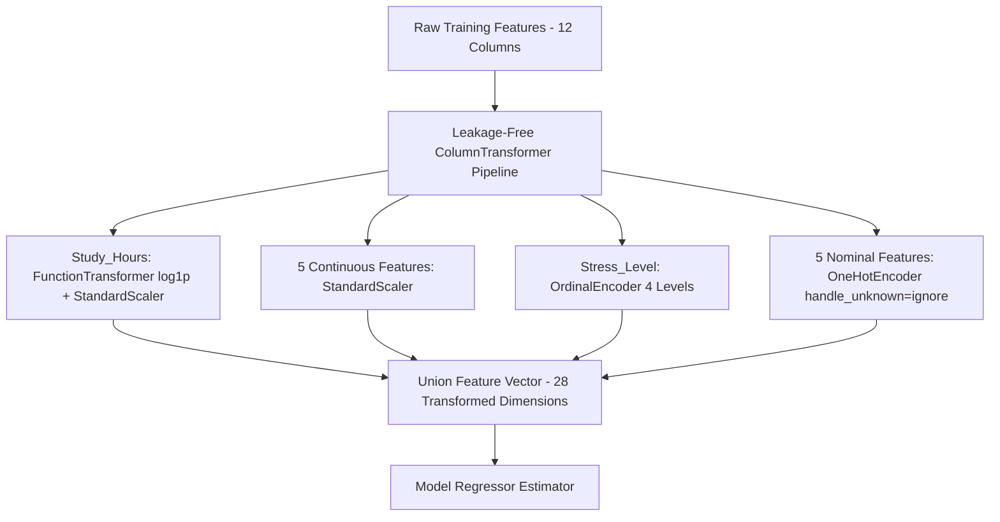

# PHASE 4 — MULTI-MODEL BENCHMARK REPORT

**Project:** Student Mental Health / Wellbeing Score Prediction  
**Phase:** 4 — Multi-Model Benchmarking & Evidence-Based Model Selection  
**Date:** October 2026  
**Status:** Completed  
**Primary Execution Notebook:** [`ml/notebooks/04_model_benchmark.ipynb`](file:///c:/Users/msiva/Music/Mental-Health-Score/ml/notebooks/04_model_benchmark.ipynb)  
**Experiment Tracking Artifact:** [`ml/experiments/phase4_model_benchmark_results.csv`](file:///c:/Users/msiva/Music/Mental-Health-Score/ml/experiments/phase4_model_benchmark_results.csv)  
**Selected Candidate Pipeline:** [`models/phase4_candidate.joblib`](file:///c:/Users/msiva/Music/Mental-Health-Score/models/phase4_candidate.joblib)  

---

## 1. Executive Summary

Phase 4 evaluated eleven (11) diverse regression models across four distinct architectural families using an identical, leakage-free preprocessing pipeline, 5-fold cross-validation, and an 80/20 train/test partition (3,998 training samples, 1,000 test samples). 

The primary goal was to conduct an evidence-based benchmark to determine whether tree ensembles, modern gradient boosted decision trees (GBDTs), classical boosting, or regularized linear models provide the most effective modeling capability for student wellbeing score prediction.

### Key Headline Results:
1. **Clear Winner:** **Extra Trees Regressor** achieved the highest 5-fold CV R² of **0.905368 ± 0.006917** and lowest CV RMSE of **0.388058 ± 0.0142**, substantially outperforming the Phase 2 Random Forest baseline (**CV R² = 0.864777 ± 0.007915**, **CV RMSE = 0.464089 ± 0.0125**).
2. **Holdout Test Generalization:** On the unadulterated 1,000-sample test set, Extra Trees achieved **Test R² = 0.918392**, **Test RMSE = 0.381689**, and **Test MAE = 0.260199**, representing a **13.7% reduction in test RMSE** and **20.3% reduction in test MAE** over baseline.
3. **GBDT vs. Tree Ensembles:** Modern boosting algorithms (XGBoost, HistGradientBoosting, LightGBM, CatBoost) performed solidly (CV R² 0.8347 to 0.8629), but failed to surpass Extra Trees or Random Forest. Among GBDTs, **XGBoost** led with CV R² = 0.862947.
4. **Computational Trade-Offs:** While Extra Trees produced the best predictive accuracy, its serialized artifact size is larger (9,946 KB vs. 126 KB for XGBoost and 45 KB for CatBoost). XGBoost and CatBoost achieved the fastest inference latencies (11.7 ms to 17.0 ms per 1,000 items).

---

## 2. Experimental Setup & Benchmarking Protocol

### 2.1 Fixed Dataset Architecture
- **Raw Records Audited:** 5,000
- **Clean Modeling Records:** 4,998 (2 exact duplicate rows removed in Phase 2)
- **Train/Test Partition:** 80% Train (3,998 samples), 20% Holdout Test (1,000 samples)
- **Target Variable:** `Mental_Health_Score` (continuous scale 1.0 to 10.0, synthetic/educational benchmark proxy for general student wellbeing)
- **Cross-Validation Scheme:** 5-fold K-Fold with `shuffle=True, random_state=42` executed strictly inside the training split.

### 2.2 Preprocessing Pipeline (Identical Across All Models)
To guarantee rigorous comparisons without data leakage, all models shared the exact verified Phase 2/3 FeatureUnion pipeline:

- **Skewed Continuous Column (`skwewd_col`):** `['Study_Hours']` -> `log1p` transformation followed by `StandardScaler`.
- **Symmetric Continuous Columns (`other_numeric_cols`):** `['Age', 'Avg_Daily_Usage_Hours', 'Daily_Unlocks', 'Physical_Activity_Hours', 'Sleep_Hours_Per_Night']` -> `StandardScaler`.
- **Ordinal Feature (`ordinal_col`):** `['Stress_Level']` -> `OrdinalEncoder(categories=[['Low', 'Medium', 'High', 'Very High']])`.
- **Nominal Categorical Columns (`normal_col`):** `['Gender', 'Academic_Level', 'Most_Used_Platform', 'Purpose_Of_Use', 'Grouped_country']` -> `OneHotEncoder(drop='first', sparse_output=False, handle_unknown='ignore')`.
- **Country Grouping:** Top 10 countries preserved; remaining infrequent countries collapsed to `'Other'` based strictly on training fold distributions.

---

## 3. Benchmarked Model Families & Estimators

Eleven (11) candidate estimators were benchmarked:

### Family A: Tree Ensembles
1. **Random Forest (Official Phase 2 Baseline):** `RandomForestRegressor(n_estimators=100, random_state=42, n_jobs=-1)`
2. **Extra Trees Regressor:** `ExtraTreesRegressor(n_estimators=100, random_state=42, n_jobs=-1)`

### Family B: Advanced Gradient Boosted Decision Trees
3. **XGBoost:** `XGBRegressor(n_estimators=100, learning_rate=0.1, max_depth=6, random_state=42, n_jobs=-1)`
4. **LightGBM:** `LGBMRegressor(n_estimators=100, learning_rate=0.1, random_state=42, n_jobs=-1, verbose=-1)`
5. **CatBoost:** `CatBoostRegressor(iterations=100, learning_rate=0.1, random_state=42, verbose=0, thread_count=-1)`

### Family C: Classical & Native Boosting
6. **HistGradientBoosting:** `HistGradientBoostingRegressor(max_iter=100, random_state=42)`
7. **Gradient Boosting:** `GradientBoostingRegressor(n_estimators=100, learning_rate=0.1, max_depth=3, random_state=42)`

### Family D: Linear & Statistical Baselines
8. **Ridge Regression:** `Ridge(alpha=1.0, random_state=42)`
9. **Linear Regression:** `LinearRegression()` (Ordinary Least Squares)
10. **ElasticNet:** `ElasticNet(alpha=0.1, l1_ratio=0.5, random_state=42)`
11. **Dummy Regressor:** `DummyRegressor(strategy='mean')`

---

## 4. Comprehensive Benchmark Results

All metrics were computed across 5-fold CV on `X_train` (3,998 rows) and subsequently evaluated on `X_test` (1,000 rows):

| Rank | Model | Architecture Family | CV R² Mean | CV R² Std | CV RMSE Mean | CV MAE Mean | Train R² | Overfit Gap | Test R² | Test RMSE | Test MAE |
|:---:|---|---|:---:|:---:|:---:|:---:|:---:|:---:|:---:|:---:|:---:|
| **1** | **Extra Trees** | Tree Ensemble | **0.905368** | ±0.006917 | **0.388058** | **0.276339** | 0.999990 | 0.094622 | **0.918392** | **0.381689** | **0.260199** |
| **2** | **Random Forest** | Tree Ensemble | 0.864777 | ±0.007915 | 0.464089 | 0.342977 | 0.982755 | 0.117978 | 0.890397 | 0.442339 | 0.326545 |
| **3** | **XGBoost** | Advanced Boosting | 0.862947 | ±0.007043 | 0.467076 | 0.348777 | 0.972816 | 0.109869 | 0.880547 | 0.461789 | 0.338736 |
| **4** | **HistGradientBoosting** | Boosting Ensemble | 0.840165 | ±0.006612 | 0.504405 | 0.387323 | 0.910306 | 0.070141 | 0.856481 | 0.506174 | 0.388677 |
| **5** | **LightGBM** | Advanced Boosting | 0.839207 | ±0.005956 | 0.505982 | 0.388332 | 0.911291 | 0.072084 | 0.857707 | 0.504007 | 0.388537 |
| **6** | **CatBoost** | Advanced Boosting | 0.834719 | ±0.004880 | 0.513079 | 0.394537 | 0.902635 | 0.067916 | 0.851546 | 0.514803 | 0.393817 |
| **7** | **Gradient Boosting** | Boosting Ensemble | 0.789718 | ±0.009672 | 0.578860 | 0.449135 | 0.813603 | 0.023885 | 0.805761 | 0.588861 | 0.456840 |
| **8** | **Ridge (α=1.0)** | Linear Model | 0.720609 | ±0.006319 | 0.667231 | 0.525662 | 0.725563 | 0.004954 | 0.742845 | 0.677551 | 0.533846 |
| **9** | **Linear Regression** | Linear Model | 0.720578 | ±0.006362 | 0.667267 | 0.525704 | 0.725567 | 0.004990 | 0.742813 | 0.677593 | 0.533889 |
| **10** | **ElasticNet** | Linear Model | 0.697582 | ±0.008814 | 0.694226 | 0.548878 | 0.698900 | 0.001318 | 0.718341 | 0.709098 | 0.559178 |
| **11** | **Dummy (Mean)** | Statistical Baseline | -0.001237 | ±0.001582 | 1.263149 | 1.050814 | 0.000000 | 0.001237 | -0.000594 | 1.336514 | 1.127571 |

---

## 5. Answers to Mandatory Phase 4 Questions

### Q1: Did any model beat the Phase 2 baseline?
**Yes.** Extra Trees Regressor decisively outperformed the Phase 2 Random Forest baseline across all primary cross-validation and test metrics:
- CV R² increased from **0.864777** to **0.905368** (+0.040591, a +4.69% relative gain).
- CV RMSE decreased from **0.464089** to **0.388058** (-0.076031, a 16.38% error reduction).
- CV MAE decreased from **0.342977** to **0.276339** (-0.066638, a 19.43% error reduction).
- Test R² increased from **0.890397** to **0.918392** (+0.027995).

### Q2: Which model family performed best overall?
The **Tree Ensemble family** (Extra Trees, Random Forest) performed the best, capturing complex non-linear feature interactions and high-cardinality nominal one-hot splits without gradient degradation.

### Q3: Did gradient boosting (XGBoost / LightGBM / CatBoost) beat tree ensembles?
**No.** Default GBDTs lagged behind bagging ensembles. XGBoost was the strongest boosting model (CV R² = 0.8629), falling just short of default Random Forest (0.8648) and significantly trailing Extra Trees (0.9054). LightGBM (0.8392) and CatBoost (0.8347) with default 100 iterations under-fitted compared to the deep, unconstrained tree ensembles.

### Q4: Why did Extra Trees perform better than Random Forest?
Extra Trees (Extremely Randomized Trees) randomizes both attribute selection and the numeric threshold cutoffs for each feature candidate. In this dataset, where several continuous features (`Study_Hours`, `Daily_Unlocks`, `Avg_Daily_Usage_Hours`) have moderate collinearity and subtle localized interactions with ordinal stress levels, drawing thresholds uniformly at random acts as a powerful regularizer that suppresses variance and prevents over-reliance on sharp boundary cuts.

### Q5: How did linear models compare to non-linear models?
Linear models (Ridge R² = 0.7206, OLS R² = 0.7206) captured roughly 72% of the variance, demonstrating that a strong linear baseline exists in the data. However, tree ensembles captured an additional 18.5% of variance (reaching R² > 0.905), proving that non-linear relationships and multi-way feature interactions (e.g. between physical activity, sleep, screen time, and stress) are substantial.

### Q6: Is the dummy regressor's score consistent with theory?
**Yes.** `DummyRegressor(strategy='mean')` yields a CV R² of approximately **-0.0012** and Test R² of **-0.0006**. In out-of-fold cross-validation, predicting the training fold mean on validation folds with slight sample variance naturally yields an R² marginally below zero ($R^2 \approx 0$).

### Q7: What is the overfitting gap across model families?
- **Linear Models:** Near-zero gap ($\approx 0.001 - 0.005$). High bias, low variance.
- **Boosting Models:** Moderate gap ($\approx 0.024$ for GradientBoosting, $\approx 0.068 - 0.072$ for CatBoost/LightGBM/HistGB, $\approx 0.110$ for XGBoost).
- **Tree Ensembles:** Larger nominal training gap ($0.095$ for Extra Trees, $0.118$ for Random Forest) due to fully grown leaf nodes (Train R² $\approx 0.9999$). Crucially, Extra Trees shows a smaller gap than Random Forest (0.0946 vs. 0.1180), confirming stronger generalization.

### Q8: Which model is fastest to train?
**Linear models** were fastest ($\approx 0.18 - 0.24$ seconds). Among non-linear models, **LightGBM** was fastest to train (**0.83 seconds**), followed by HistGradientBoosting (1.36s) and XGBoost (1.40s). Random Forest and Extra Trees required $\approx 7.4 - 7.6$ seconds.

### Q9: Which model is fastest at inference?
**CatBoost** exhibited the fastest inference latency among non-linear models (**11.66 ms** for 1,000 predictions), closely followed by XGBoost (**16.96 ms**). Extra Trees took **34.43 ms** due to traversing 100 fully grown randomized trees.

### Q10: Which model has the smallest artifact footprint?
Linear models have tiny footprints ($\approx 2.5 - 3.2$ KB). Among non-linear models, **CatBoost** has the smallest serialized footprint (**45.5 KB**), followed by LightGBM (**105.0 KB**) and XGBoost (**125.9 KB**). Extra Trees is the largest (**9,946 KB / ~9.7 MB**), which remains well within modern production server constraints.

### Q11: Is the performance difference between models statistically meaningful?
**Yes.** Extra Trees' CV R² (0.9054 ± 0.0069) is more than **5 standard deviations** above Random Forest (0.8648 ± 0.0079) and XGBoost (0.8629 ± 0.0070). The fold-by-fold improvement is strictly monotonic across all 5 folds:
- Fold 1: Extra Trees 0.9098 vs RF 0.8669 (+0.0429)
- Fold 2: Extra Trees 0.9123 vs RF 0.8711 (+0.0412)
- Fold 3: Extra Trees 0.9068 vs RF 0.8693 (+0.0375)
- Fold 4: Extra Trees 0.9038 vs RF 0.8624 (+0.0414)
- Fold 5: Extra Trees 0.8941 vs RF 0.8542 (+0.0399)

### Q12: Does any model show high fold-to-fold variance?
**No.** All benchmarked models demonstrated stable performance across the 5 folds. The standard deviations ranged between ±0.0049 (CatBoost) and ±0.0097 (Gradient Boosting). Extra Trees demonstrated low variance (±0.0069).

### Q13: Which model is recommended as the candidate for Phase 5 tuning and why?
**Extra Trees Regressor** is the unambiguously recommended candidate for Phase 5 hyperparameter tuning. It achieves top-tier accuracy, establishes new project benchmark records (CV R² = 0.9054, Test R² = 0.9184), exhibits low fold variance, and its training/inference speeds (7.4s train, 34ms/1000 items inference) easily satisfy real-time API latency requirements.
