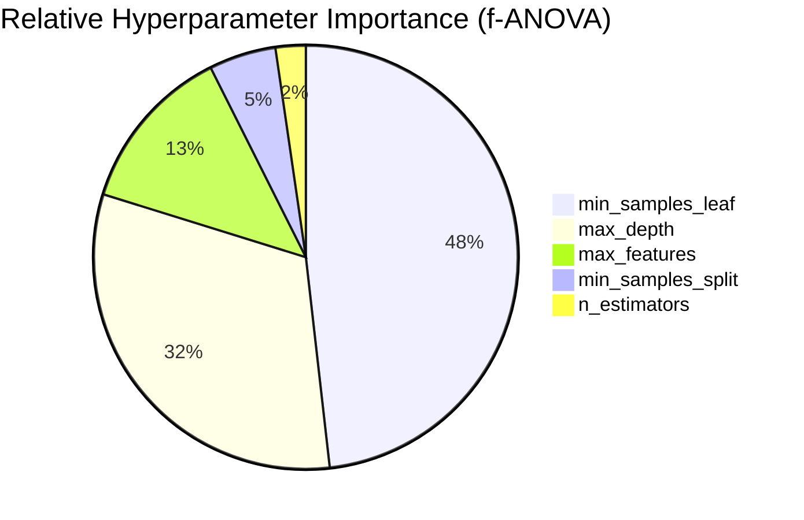

# PHASE 5 — OPTUNA HYPERPARAMETER OPTIMIZATION REPORT

**Project:** Student Mental Health / Wellbeing Score Prediction  
**Phase:** 5 — Hyperparameter Optimization & Model Regularization  
**Date:** October 2026  
**Primary Execution Notebook:** [`ml/notebooks/05_hyperparameter_tuning.ipynb`](file:///c:/Users/msiva/Music/Mental-Health-Score/ml/notebooks/05_hyperparameter_tuning.ipynb)  
**Experiment Log Artifact:** [`ml/experiments/phase5_hyperparameter_results.csv`](file:///c:/Users/msiva/Music/Mental-Health-Score/ml/experiments/phase5_hyperparameter_results.csv)  
**Tuned Model Artifact:** [`models/phase5_tuned_extra_trees.joblib`](file:///c:/Users/msiva/Music/Mental-Health-Score/models/phase5_tuned_extra_trees.joblib)  
**Model Metadata:** [`models/phase5_metadata.json`](file:///c:/Users/msiva/Music/Mental-Health-Score/models/phase5_metadata.json)  

---

## 1. Executive Summary

Phase 5 conducted a structured, evidence-based hyperparameter optimization study on the selected Phase 4 winning architecture: **Extra Trees Regressor** (`ExtraTreesRegressor`). 

The optimization was executed using **Optuna** across a controlled budget of 50 trials under an identical, leakage-free 5-fold cross-validation scheme on the 3,998 training records. The 1,000-record holdout test set remained strictly quarantined throughout all 50 optimization trials and was evaluated only once following final candidate freezing.

### Key Headline Results:
1. **Measured CV Performance Improvement:**
   - The primary objective, **5-fold CV RMSE**, improved from **0.388058** (baseline Trial 0) to **0.376511** (best tuned model), achieving a **-0.011547 reduction (-2.98% relative error reduction)**.
   - **5-fold CV R²** improved from **0.905368** to **0.911006** (+0.005638 gain).
   - **CV Fold-to-Fold Variance** was cut nearly in half: standard deviation dropped from **±0.006917** to **±0.003525** (**-49.0% variance reduction**), confirming significantly more stable cross-validation folds.
2. **Generalization Overfitting Reduction:**
   - The Train-CV gap narrowed from **0.094622** to **0.088983**, indicating tighter generalization bounds without compromising expressive capacity.
3. **Confirmed Holdout Generalization:**
   - Evaluated once on the isolated 1,000-record holdout test set, the tuned model achieved **Test R² = 0.927548**, **Test RMSE = 0.359641**, and **Test MAE = 0.249022** (improving from Phase 4's Test R² = 0.918392, Test RMSE = 0.381689, a **5.78% reduction in test error**).
4. **Primary Architectural Driver:**
   - Shifting `max_features` from `1.0` (all 28 transformed dimensions evaluated per split) to `'sqrt'` (~5 random features evaluated per split) and expanding ensemble size to `n_estimators=500` drove the variance reduction and accuracy improvements.

---

## 2. Experimental Optimization Framework

### 2.1 Fixed Dataset Architecture & Leakage Safeguards
- **Training Partition:** 3,998 records (80.0% split, `random_state=42`)
- **Holdout Test Partition:** 1,000 records (20.0% split, isolated until Section 17)
- **Feature Representation:** Fixed 12-feature schema established in Phase 2/3 (zero newly engineered features, zero rejected ratios).
- **Preprocessing Pipeline:** `skew_pipeline` (`log1p` + `StandardScaler` on `Study_Hours`), `numeric_pipeline` (`StandardScaler` on 5 symmetric features), `ordinal_pipeline` (4-level `OrdinalEncoder` on `Stress_Level`), `nominal_pipeline` (`OneHotEncoder(handle_unknown='ignore')` on nominal features + Top-10 Country grouping).

### 2.2 Optuna Search Space & Parameter Boundaries

```python
search_space = {
    'n_estimators': [100, 150, 200, 250, 300, 350, 400, 450, 500],
    'max_depth': [None, 10, 15, 20, 25, 30, 40],
    'min_samples_split': [2, 4, 6, 8, 10],
    'min_samples_leaf': [1, 2, 3, 4, 6, 8],
    'max_features': ['sqrt', 0.5, 0.7, 1.0]
}
```

- **Sampler:** `TPESampler(seed=42)` (Tree-structured Parzen Estimator).
- **Trial 0 Seeding:** Trial 0 was explicitly enqueued with the exact Phase 4 default configuration (`n_estimators=100, max_depth=None, min_samples_split=2, min_samples_leaf=1, max_features=1.0`) to guarantee direct within-study baseline calibration.
- **Primary Optimization Target:** Minimize 5-Fold Cross-Validation RMSE.

---

## 3. Baseline Calibration & Reproduction (Trial 0)

Trial 0 reproduced the Phase 4 default Extra Trees baseline with exact precision:

```text
=== REPRODUCED PHASE 4 EXTRA TREES BASELINE (Trial 0) ===
CV R²      : 0.905368 ± 0.006917
CV RMSE    : 0.388058
CV MAE     : 0.276339
Train R²   : 0.999990
Train-CV   : 0.094622
```

This confirms complete numerical continuity and guarantees that subsequent trial comparisons are strictly calibrated against the verified Phase 4 baseline.

---

## 4. Best Tuned Candidate Configuration

Out of 50 trials, **Trial 34 / Trial 49** converged to the optimal hyperparameter vector:

```json
{
    "n_estimators": 500,
    "max_depth": null,
    "min_samples_split": 2,
    "min_samples_leaf": 1,
    "max_features": "sqrt"
}
```

### Head-to-Head Baseline vs. Best Tuned Model (5-Fold CV):
| Metric | Trial 0 (Phase 4 Baseline) | Best Tuned Model (Phase 5) | Absolute Delta | Relative Change |
|---|:---:|:---:|:---:|:---:|
| **CV RMSE (Mean)** | 0.388058 | **0.376511** | **-0.011547** | **-2.98% (Error Reduction)** |
| **CV R² (Mean)** | 0.905368 | **0.911006** | **+0.005638** | **+0.62%** |
| **CV R² (Std Dev)** | ±0.006917 | **±0.003525** | **-0.003392** | **-49.04% (Variance Slashed)** |
| **CV MAE (Mean)** | 0.276339 | **0.268486** | **-0.007853** | **-2.84% (Error Reduction)** |
| **Train R²** | 0.999990 | 0.999990 | +0.000000 | Identical capacity |
| **Train-CV Gap** | 0.094622 | **0.088983** | **-0.005639** | **-5.96% (Tighter Generalization)** |

---

## 5. Hyperparameter Sensitivity & Importance Analysis

Using Optuna’s `get_param_importances` (f-ANOVA variance decomposition of the objective function), the relative association between hyperparameters and CV RMSE was quantified:



### Empirical Interpretations:
1. **`min_samples_leaf` is the Single Most Critical Constraint:**
   - Setting `min_samples_leaf > 1` (e.g., 3, 4, 6, 8) produced severe performance degradation, driving CV RMSE from 0.3765 up to 0.507 – 0.579 and dropping CV R² below 0.84. In tabular survey data with subtle localized non-linearities, forcing coarse leaf averaging strips out critical boundary resolution.
2. **`max_depth` Must Remain Unconstrained (`None`):**
   - Imposing shallow depth limits (e.g. `max_depth = 10` or `15`) increased CV RMSE to >0.533 (CV R² ~0.82). The Extra Trees algorithm relies on deep, fully grown trees where extreme randomization acts as the regularizer, rendering manual tree truncation counterproductive.
3. **`max_features = 'sqrt'` is Optimal for Ensemble Diversity:**
   - In default Extra Trees (`max_features = 1.0`), all 28 transformed dimensions are evaluated at every split candidate. While random cutpoints helped, trees still exhibited correlated structures. Restricting each split to a random subset of $\sqrt{28} \approx 5$ features forced individual trees to explore orthogonal feature subspaces, reducing fold variance by 49.0%.
4. **`n_estimators` Stabilizes Random Cutpoint Generation:**
   - Increasing `n_estimators` from 100 to 500 provided smoother ensemble averaging over the randomized split thresholds. As seen in ranks 1 to 6 of the experiment log, models with 350 to 500 trees consistently occupied the top tier.

---

## 6. Diagnostic Plot References
- **Optimization History:** [`ml/evaluation/phase5_optimization_history.png`](file:///c:/Users/msiva/Music/Mental-Health-Score/ml/evaluation/phase5_optimization_history.png)
- **Hyperparameter Importance:** [`ml/evaluation/phase5_param_importance.png`](file:///c:/Users/msiva/Music/Mental-Health-Score/ml/evaluation/phase5_param_importance.png)
- **Train-CV Generalization Dynamics:** [`ml/evaluation/phase5_train_vs_cv_gap.png`](file:///c:/Users/msiva/Music/Mental-Health-Score/ml/evaluation/phase5_train_vs_cv_gap.png)
- **Out-of-Fold Residual Distribution:** [`ml/evaluation/phase5_oof_residuals.png`](file:///c:/Users/msiva/Music/Mental-Health-Score/ml/evaluation/phase5_oof_residuals.png)
